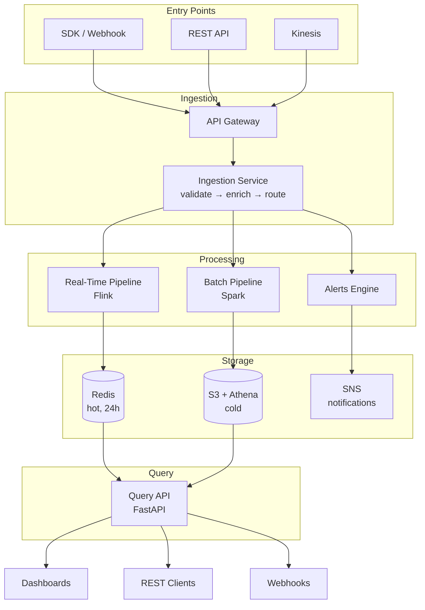
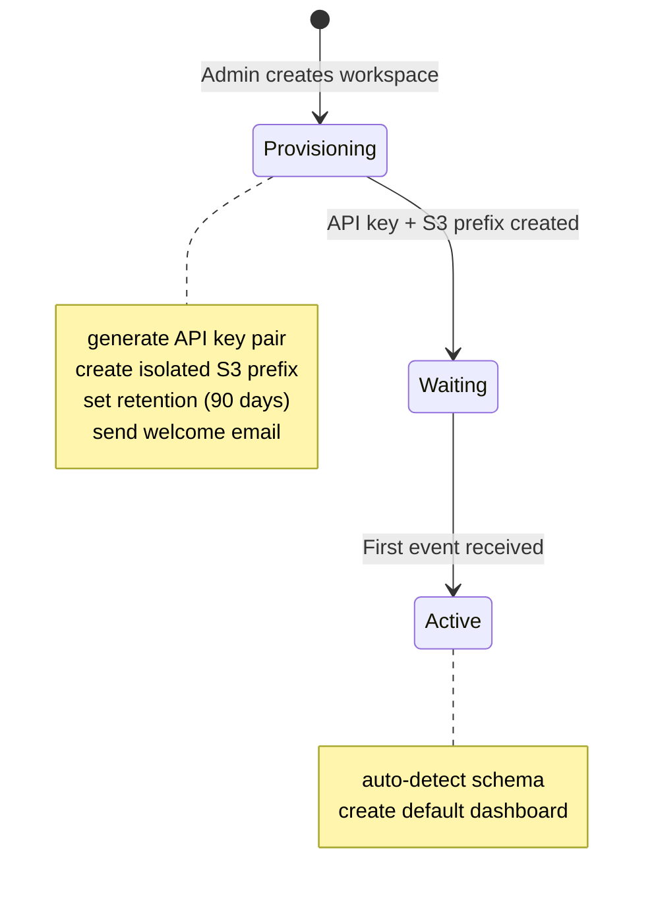
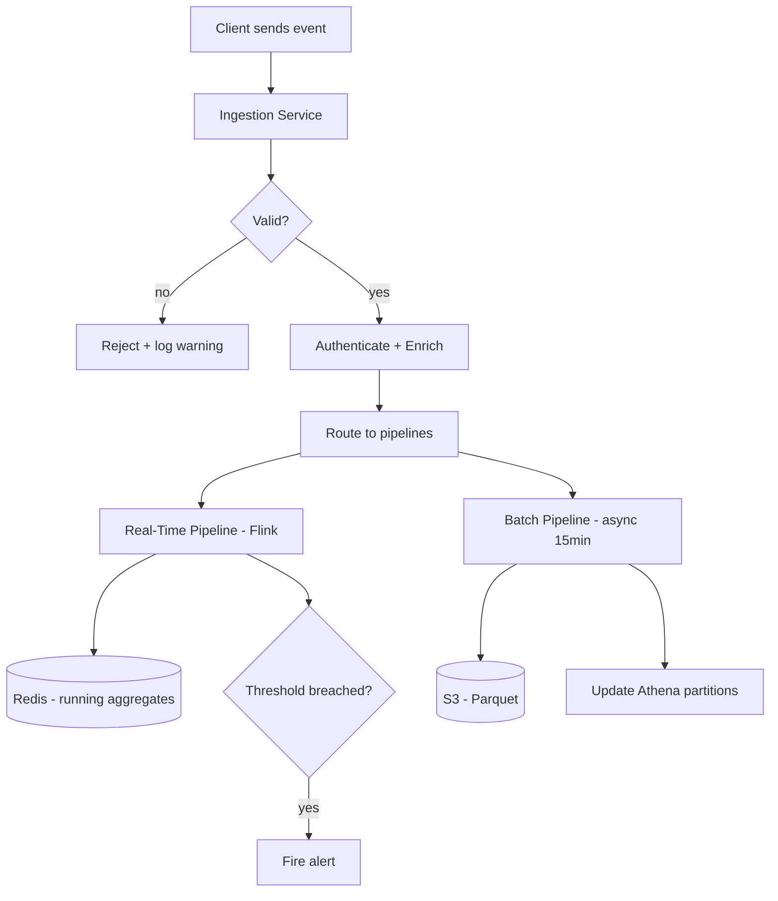
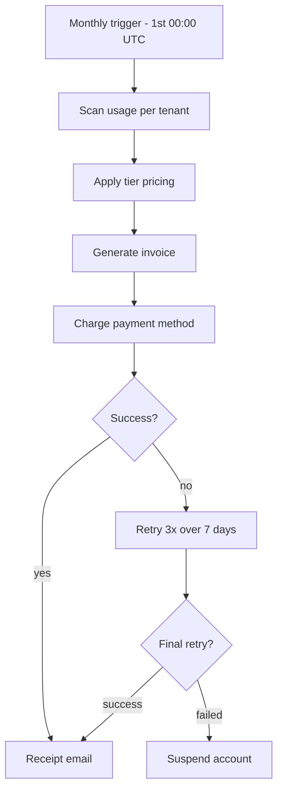

> **Worked example, not a real system.** Acme Platform is fictional. Every
> number, endpoint, and component here exists to show the writing rules applied
> rather than described. Do not cite it as a case study.

# Acme Platform: Real-Time Analytics API

A multi-tenant analytics platform that ingests event streams, processes them in real-time, and serves dashboards and API queries. Built on AWS, handles 50K events/second at peak.

## Quick Start

```bash
# Install dependencies
uv sync

# Set up environment
cp .env.example .env       # fill in required values

# Run locally (API + worker)
docker compose up

# Run tests
uv run pytest tests/unit/ -v

# Deploy to staging
./scripts/deploy.sh staging
```

## Architecture

Events arrive via HTTP or Kinesis, get enriched and aggregated by a worker fleet, and land in both a hot store (Redis) for real-time queries and a cold store (S3 + Athena) for historical analysis. The API serves dashboards and programmatic access with sub-200ms p95 latency.



Events arrive at the ingestion service, fan out to a real-time path and a batch
path, and both land in storage that the Query API reads. Dashboards, REST
clients, and webhooks are all consumers of that one API.

### Key components

| Component | What it does | Where |
|-----------|-------------|-------|
| Ingestion Service | Validates, enriches, routes incoming events | `src/ingestion/` |
| Real-Time Pipeline | Sub-second aggregations (counts, uniques, funnels) | `src/pipeline/realtime/` |
| Batch Pipeline | Historical rollups, retention policies, backfills | `src/pipeline/batch/` |
| Query API | Serves dashboards and programmatic queries | `src/api/` |
| Alerts Engine | Threshold monitoring, anomaly detection, notifications | `src/alerts/` |

## Business Flows

### Tenant onboarding

A workspace moves through three states. **Provisioning** generates the API key
pair, creates the tenant's isolated S3 prefix, sets 90-day retention, and sends
the welcome email. **Waiting** holds until the first event arrives. **Active**
auto-detects the event schema and creates a default dashboard.



### Event ingestion

An incoming event is validated first: invalid events are rejected and logged as a
warning, and never enter a pipeline. Valid events are authenticated, enriched,
and routed to both pipelines at once. The real-time path writes running
aggregates to Redis and fires an alert when a threshold is breached. The batch
path writes Parquet to S3 every fifteen minutes and updates the Athena
partitions.



### Billing cycle

On the first of the month at 00:00 UTC, usage is scanned per tenant, tier pricing
is applied, and an invoice is generated and charged. A successful charge sends a
receipt. A failed charge retries three times over seven days; if the final retry
also fails, the account is suspended.



## Project Structure

```
├── src/
│   ├── api/                # Query API (FastAPI)
│   ├── ingestion/          # Event intake and validation
│   ├── pipeline/
│   │   ├── realtime/       # Flink jobs (aggregation, sessions)
│   │   └── batch/          # Spark jobs (rollups, retention)
│   ├── alerts/             # Threshold monitoring + notifications
│   ├── billing/            # Usage metering and invoicing
│   └── shared/             # Common utilities, models, auth
├── infra/                  # Terraform (AWS infrastructure)
│   ├── modules/            # Reusable modules (vpc, ecs, kinesis)
│   └── environments/       # Per-env tfvars (staging, prod)
├── tests/
│   ├── unit/               # Fast, mocked tests
│   ├── integration/        # Hits real services (localstack)
│   └── load/               # k6 load test scripts
├── scripts/
│   ├── deploy.sh           # Build + deploy pipeline
│   ├── migrate.sh          # Database migrations
│   └── seed.sh             # Seed test data
├── dashboards/             # Grafana dashboard definitions
└── docs/                   # Architecture decisions, runbooks
```

## Development

### Prerequisites

- Python 3.12+ (uv for dependency management)
- Docker + Docker Compose (local services)
- AWS CLI configured (staging and prod profiles)
- Terraform 1.5+

### Setup

```bash
git clone git@github.com:acme/platform.git
cd platform
uv sync
uv run pre-commit install
docker compose up -d         # Redis, localstack, Flink (dev mode)
uv run pytest tests/unit/ -v # verify setup
```

### Testing

```bash
# Unit tests (fast, no external deps)
uv run pytest tests/unit/ -v

# Integration tests (requires docker compose up)
uv run pytest tests/integration/ -v

# Load tests
k6 run tests/load/ingestion.js --vus 100 --duration 60s
```

### Linting & Formatting

```bash
uv run ruff check src/ tests/
uv run ruff check src/ tests/ --fix
uv run ruff format src/ tests/
```

## Deployment

```bash
# Deploy to staging
./scripts/deploy.sh staging

# Deploy to production (requires main branch)
./scripts/deploy.sh prod

# Run migrations
./scripts/migrate.sh staging
```

### Environments

| Environment | Branch | URL | Notes |
|-------------|--------|-----|-------|
| Staging | `staging` | `api.staging.acme.io` | Auto-deploy on merge |
| Production | `main` | `api.acme.io` | Manual deploy, requires approval |

## Infrastructure

All managed via Terraform. Run from `infra/` with the appropriate environment.

| Component | Service | Purpose |
|-----------|---------|---------|
| Ingestion | ECS Fargate + ALB | Event intake (autoscaling) |
| Real-time pipeline | Managed Flink | Sub-second aggregation |
| Batch pipeline | EMR Serverless | Historical rollups |
| Hot store | ElastiCache (Redis) | Real-time query serving |
| Cold store | S3 + Athena | Historical queries |
| Event bus | Kinesis Data Streams | Event transport (3 shards) |
| Query API | ECS Fargate + ALB | Dashboard and REST queries |
| Alerts | Lambda + EventBridge | Threshold checks every 60s |
| Billing | Lambda + EventBridge | Monthly usage metering |
| Tenants | DynamoDB | Workspace config, API keys |
| Secrets | SSM Parameter Store | API keys, DB credentials |
| Monitoring | CloudWatch + Grafana | Dashboards, alarms → PagerDuty |
| DNS | Route53 | api.acme.io |

## Configuration

| Variable | Required | Description |
|----------|----------|-------------|
| `AWS_PROFILE` | Yes | AWS credentials profile |
| `REDIS_URL` | Yes | ElastiCache endpoint |
| `KINESIS_STREAM` | Yes | Ingest stream name |
| `ALERT_SNS_TOPIC` | Yes | SNS topic for alert notifications |
| `STRIPE_KEY` | No | Payment processing (empty = invoicing disabled) |
| `LOG_LEVEL` | No | Logging verbosity (default: INFO) |

## Dev Workflow

```
feature branch → staging PR → deploy staging → verify → main PR → deploy prod
```

| Step | Command | What it does |
|------|---------|-------------|
| Run locally | `docker compose up` | Full stack on localhost |
| Test | `uv run pytest` | Unit + integration |
| Load test | `k6 run tests/load/ingestion.js` | Verify throughput |
| Deploy staging | `./scripts/deploy.sh staging` | Build + Terraform + ECS |
| Verify | `curl api.staging.acme.io/health` | Smoke test |
| Ship to prod | `./scripts/deploy.sh prod` | After staging verification |

## Monitoring & Alerts

| Alert | Threshold | Action |
|-------|-----------|--------|
| Ingestion latency | p99 > 500ms | Scale ECS tasks |
| Pipeline lag | > 30s behind | Check Flink checkpoints |
| Redis memory | > 80% | Trigger eviction or scale |
| Error rate | > 1% of requests | Page on-call |
| Billing failure | 3 consecutive retries | Manual review |

Grafana dashboards in `dashboards/`: auto-provisioned on deploy.

## Contributing

- Branch from `staging` (never commit directly to `main`)
- PRs require passing CI (lint + test + integration)
- Linear history enforced (rebase, no merge commits)
- Pre-commit hooks run automatically (`uv run pre-commit install`)
- Load tests required for any ingestion or query path changes

See [example-architecture.md](./example-architecture.md) for system design decisions.
